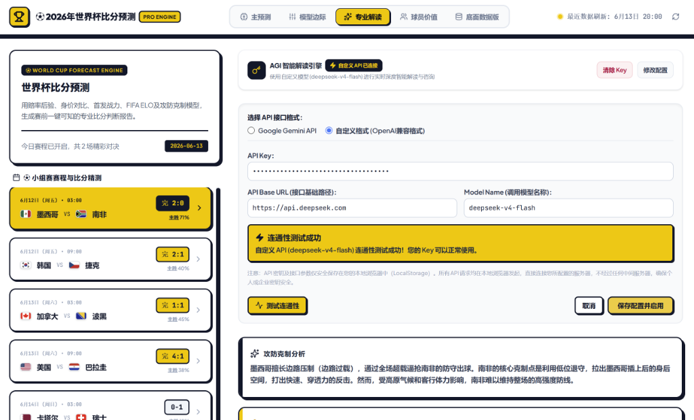

# 🏆 2026年世界杯比分预测与战术模拟分析系统 (2026 World Cup Predictor)

这是一个纯前端、零配置、零后端依赖的 **2026年世界杯双泊松比分模拟预测与战术推演系统**。该系统基于球队身价对比、FIFA/ELO积分、历史战绩、战术克制矩阵、以及高原/旅行疲劳等外部环境因子，在浏览器中进行实时双泊松建模和战术沙盘模拟。

> ⚡ **纯本地运行，隐私安全，零后端配置**：所有的比分拟合计算与模拟全部在本地前端浏览器运行。克隆后即可秒级部署或直接本地双击打开运行！

---

## 📸 网页截图与系统界面



---

## ✨ 核心功能与特色

1. **📊 全面准确的数据底座**
   - **48支球队全覆盖**：支持 2026 年世界杯 A组 到 L组 完整 12 个小组的 48 支参赛球队。
   - **权威实时数据**：录入所有球队 2026 年最新德转（Transfermarkt）身价、FIFA 官方排名、世界 Elo 积分以及主力球员信息。
   - **真实赛程与比分**：包含第一阶段完整 24 场小组赛程、比赛场馆、比赛地海拔以及已完赛的真实历史战果（如加拿大 1-1 波黑、美国 4-1 巴拉圭）。

2. **🧮 双泊松回归模拟器 (Double Poisson Engine)**
   - 动态通过期望进球率（Expected Goals, xG）与概率网格进行双泊松求解，计算双方胜平负概率及前五大概率比分。

3. **🎛️ 动态模型微调面板 (Model Tuner)**
   - 支持实时手动滑块调节身价权重、战术克制、FIFA排名、外部因子和历史状态的调节参数，页面即时重绘，秒级响应。

4. **🤖 解锁 AGI 高级功能：自定义大模型 API 与实时战术分析**
   - **支持自定义 API 配置**：用户可一键配置 Google Gemini API 密钥，或者**自定义兼容 OpenAI 格式的大模型 API（如 DeepSeek、阿里通义千问等）**。
   - **AI 战术大师实时对谈**：配置成功后，即可唤醒 AGI 智能解读引擎。针对当前对战的双方，您可以与 AI 战术大师进行深度的赛事模拟、战术克制分析和实时对话探讨。
   - **本地安全调用**：所有 API 请求均在浏览器前端直接向大模型服务商发起，不经过任何第三方中间服务器，您的 Key 与聊天数据绝对安全。

5. **🎯 已完场赛事实况回测看板 (Accuracy Backtesting)**
   - 自动对照已完场赛事的真实比分，与当前参数下的模型进行“胜平负方向”及“精确比分”精度核验，支持策略覆盖计算，展现极致的专业回测体验。

---

## 🚀 两种打开与运行方式

本系统提供了**“直接免编译运行”**和**“源代码编译开发”**两种使用方式：

### 方式一：直接双击打开（预编译版本，推荐 ⚡）
我们已经将项目打包编译好的静态文件放到了仓库中。你**不需要安装任何环境（如 Node.js 或 Git）**，即可直接体验：
1. 下载或克隆本仓库到本地。
2. 进入根目录下的 **`dist/`** 文件夹。
3. 双击直接用任意浏览器打开 **[index.html](dist/index.html)** 即可使用全部功能！
   *(注：我们已将 Vite 静态资源配置为相对路径 `./`，因此无需启动本地 Web 服务即可本地直接双击预览。)*

---

### 方式二：源代码编译开发与本地调试
如果你想对项目进行二次开发、修改代码、或本地调试，请按以下步骤操作：

#### 前提条件
- 电脑安装有 [Node.js](https://nodejs.org/) (推荐 v18 或更高版本)
- 安装有 npm（随 Node.js 自动安装）

#### 步骤 1：安装依赖包
在项目根目录下打开终端，运行：
```bash
npm install
```

#### 步骤 2：启动本地开发服务器
运行 Vite 本地开发命令：
```bash
npm run dev
```
打开浏览器访问：
👉 **[http://localhost:3000](http://localhost:3000)**
*(在本地修改代码会触发热更新，即时呈现在网页中。)*

#### 步骤 3：编译打包生产版本
如需要将修改后的项目打包生成静态文件：
```bash
npm run build
```
这会在根目录下生成 `dist/` 文件夹，里面包含了经过压缩优化的高性能单页应用文件（HTML/CSS/JS）。你可以将此目录直接部署到 Vercel, Netlify 或 GitHub Pages 等静态托管平台。

---

## ☁️ 一键静态部署指南

由于本系统是**纯前端静态单页应用**，不需数据库和服务器，您可以免费且秒级地部署至公网：

### 部署到 Vercel/Netlify
1. 导入您的 GitHub 仓库。
2. 配置构建命令：
   - **Build Command**: `npm run build`
   - **Output Directory**: `dist`
3. 点击 **Deploy**，几秒钟后即可获得公网访问 URL。
